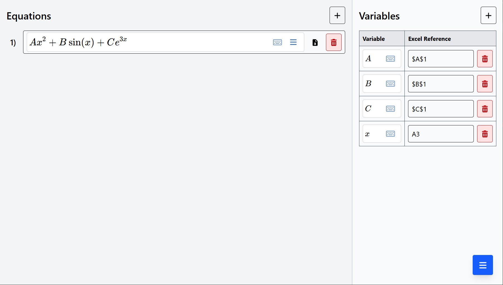
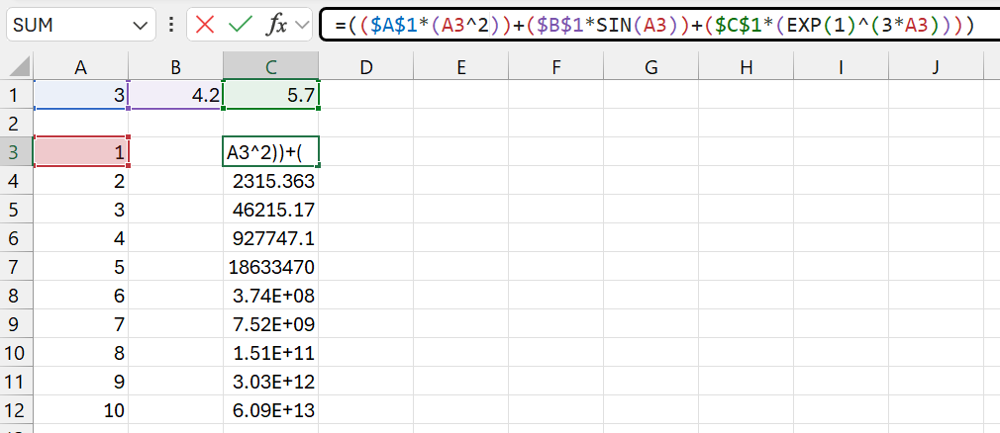

# mathquiver
A Desmos-like experience to type Excel formulas in a more sane manner. Check it out [here](https://tejashah88.github.io/mathquiver/)!

## Features
- Desmos-like equation typing experience
- Supports desktop and tablet viewing (mobile not supported)
- Can convert algebra-level equations to Excel formulas with variable replacement
- Can export/import working space (as file) for later

## Screenshots




## How to use
1. Enter your desired equations in the 'Equations' section.
   - Any ***orange*** borders indicate an incomplete equation.
   - Any ***red*** borders indicate an unconvertable equation. **Only a limited subset of Excel functions are supported.**
2. Enter your desired variables in the 'Variables' section.
   - The 'Variable' subtitle should contain the exact variable to be replaced.
   - The 'Excel Reference' subtitle should contain the **starting** excel reference. Add anchors ($) where necessary.
3. Click the Excel file icon to copy the corresponding Excel formula.

### Tips
- You can directly copy-paste LaTeX expressions into the equations boxes.
- Type starting with '\\' to type in LaTeX mode.
- You can get a LaTeX render of the equation via the "Copy Image" menu command.
- You can export (and import) this workspace for working on it later.

## For developers

### Setup
```bash
git clone https://github.com/tejashah88/mathquiver.git
cd mathquiver
npm install
```

### Running the development server
```bash
npm run dev
```

Open [http://localhost:3000/mathquiver](http://localhost:3000/mathquiver) in a new browser tab.

### Creating a static site export
```bash
npm run build
```

Open [out\index.html](out\index.html) in a new browser tab.
