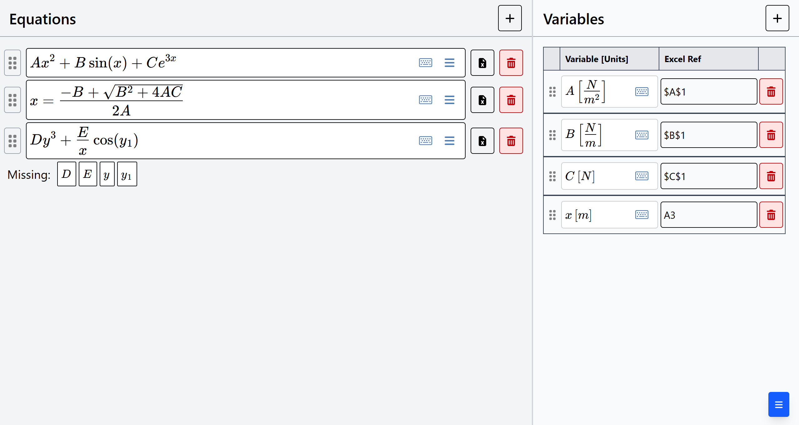
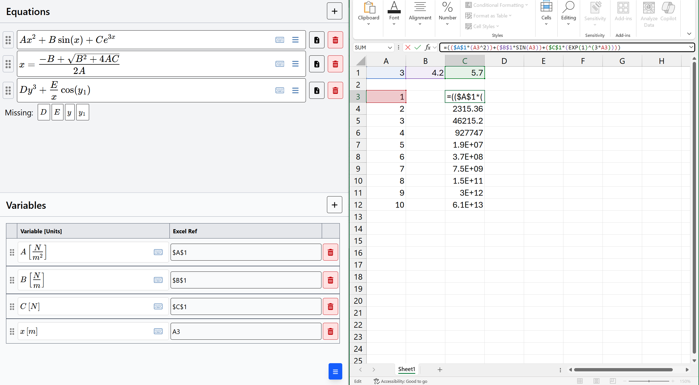

# MathQuiver: Sane Equation Typing for Excel
A Desmos-like experience to type Excel formulas in a more sane manner. Check it out [here](https://tejashah88.github.io/mathquiver/)!




Try out the example by downloading and importing [this workspace file](docs/mathquiver-example.json)!

## Features
- Desmos-like equation typing experience
- Can convert algebra-level equations to Excel formulas with variable replacement
- Detects missing variables and invalid Excel references
- (Should) support desktop and tablet viewing (mobile not supported)
- Can export/import workspace (as file) for later

## How to use
1. Enter your desired equations in the 'Equations' section.
   - You can type equations like f(x)=Ax+b, but only the RHS is converted.
   - Any ***orange*** borders indicate an incomplete or unparsable equation.
   - Any ***red*** borders indicate an unsupported equation.
2. Enter your desired variables in the 'Variables' section.
   - Add units in square brackets for clarity. They will not appear in the Excel formula.
   - 'Excel Ref' contains the **starting** cell reference. Use **F4** to cycle through anchors ($).
   - Any ***orange*** borders indicate a missing cell reference.
   - Any ***red*** borders indicate an invalid cell reference.
3. Click the Excel file icon to copy the corresponding Excel formula.

### Tips
- **Only a limited subset of Excel functions are supported.**
- Snap this window to either side for a side-by-side workflow with Excel.
- To add text, type **"** (double quotes) in an empty box to enter text mode.
- To add a LaTeX expression, type **\\** (backslash) to enter LaTeX mode.
- Use the equation menu (≡) to copy/paste the LaTeX expression or an image render.
- You can directly copy-paste LaTeX expressions into the equations boxes.
- Use the Import/Export buttons to save your workspace for later.

### Known Bugs
- Variables with complex subscripts are not supported like `a_{n+1}+b` or `x_{y+1}^{z}`.

## For developers

### Setup
```bash
git clone https://github.com/tejashah88/mathquiver.git
cd mathquiver
npm install
```

### Running the development server
```bash
npm run dev
```

Open [http://localhost:3000/mathquiver](http://localhost:3000/mathquiver) in a new browser tab.

### Creating a static site export
```bash
npm run build
```

Open [out\index.html](out\index.html) in a new browser tab.
